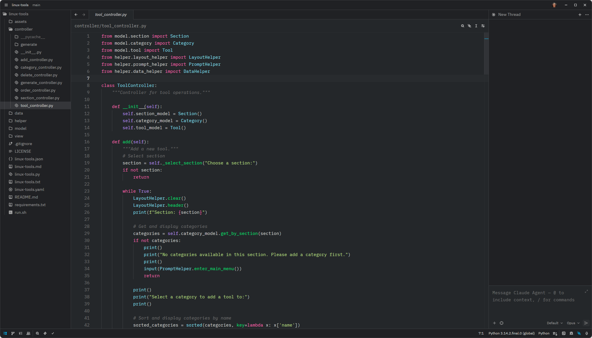

# Zed Config

My personal [Zed](https://zed.dev) editor configuration, including settings, keymap, and custom theme(s).

## Contents

- `settings.json` — Editor settings
- `keymap.json` — Custom keybindings
- `themes/` — Custom theme(s)

## Default Theme

My default theme is **Simple Dark Zed**, included in the `themes/` directory. It is a port of the [Simple Dark](https://marketplace.visualstudio.com/items?itemName=travis.simple-dark) VS Code theme by Travis.

## Usage

The files in this repository belong in `~/.config/zed/` on Linux/macOS.

To use a theme, copy the file from `themes/` into your own `~/.config/zed/themes/` directory. Then open the theme picker with `Ctrl+K` `Ctrl+T` and select it from the list. For settings and keybindings, browse the files and cherry-pick anything useful into your own configuration.

## Author

**Paul Sørensen**
[https://paulsorensen.io](https://paulsorensen.io)
[https://github.com/paulsorensen](https://github.com/paulsorensen)

## Support

If you found this project useful, a small tip is appreciated ❤️
[https://buymeacoffee.com/paulsorensen](https://buymeacoffee.com/paulsorensen)

## License

This project is licensed under the MIT License.
See [LICENSE](LICENSE) for details.
