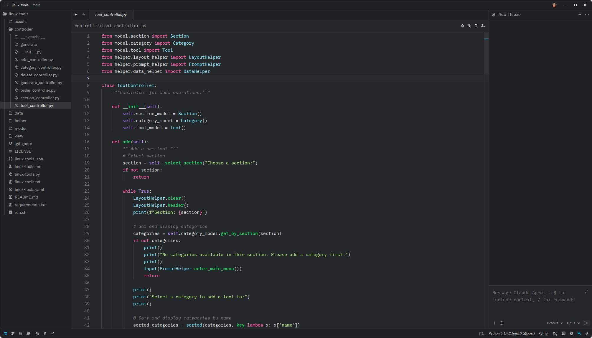

# Zed Config

[](/LICENSE)
[](https://buymeacoffee.com/paulsorensen)

My personal [Zed](https://zed.dev) editor configuration, including settings, keymap, and custom theme(s).

## Contents

- `settings.json` — Editor settings
- `keymap.json` — Custom keybindings
- `themes/` — Custom theme(s)
- `sync-to-zed.sh` — Sync config from this repo to Zed (preserves extra installed themes)
- `sync-from-zed.sh` — Sync config from Zed to this repo (exact 1:1 copy)

## Default Theme

My default theme is **Simple Dark Zed**, included in the `themes/` directory. It is a port of the [Simple Dark](https://marketplace.visualstudio.com/items?itemName=travis.simple-dark) VS Code theme by Travis.



## Usage

The files in this repository belong in `~/.config/zed/` on Linux/macOS.

### Sync Scripts

The easiest way to install or update is with the included sync scripts.

**Install repo config to Zed:**

```bash
./sync-to-zed.sh
```

Copies `settings.json`, `keymap.json`, and `themes/` to `~/.config/zed/`. Existing themes in Zed that are not in the repo are kept.

**Backup Zed config to repo:**

```bash
./sync-from-zed.sh
```

Copies `settings.json`, `keymap.json`, and `themes/` from `~/.config/zed/` to the repo. The repo becomes an exact 1:1 copy — themes not present in Zed are removed from the repo.

Both scripts prompt for confirmation before making changes.

### Manual Install

To manually install themes, copy the desired files from `themes/` into `~/.config/zed/themes/`. For settings and keybindings, copy `settings.json` and/or `keymap.json` into `~/.config/zed/`, or browse the files and cherry-pick anything useful into your own configuration.

### Changing Themes

To switch themes in Zed, open the theme picker with `Ctrl+K` `Ctrl+T` (VS Code keybindings) and select a theme from the list.

## Author

**Paul Sørensen**  

- Website: [https://paulsorensen.io](https://paulsorensen.io)  
- GitHub: [https://github.com/paulsorensen](https://github.com/paulsorensen)

## Support

If you found this project useful, a small tip is appreciated ❤️  
[https://buymeacoffee.com/paulsorensen](https://buymeacoffee.com/paulsorensen)

## License

This project is licensed under the MIT License.  
See [LICENSE](LICENSE) for details.
